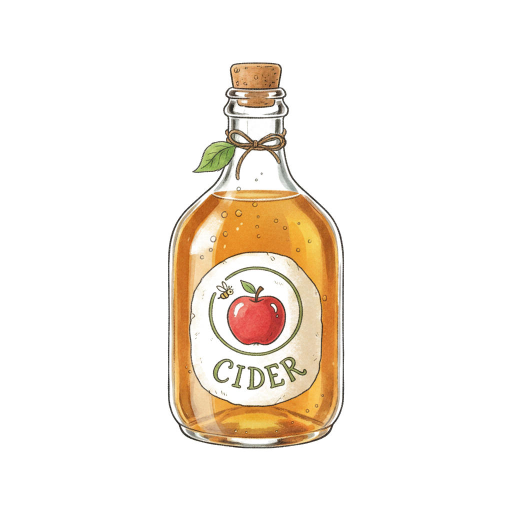

# Cider - Apple Notes CLI

A Go-based CLI tool for syncing markdown files with Apple Notes. This application was translated from [`shakedlokits/cider`](https://github.com/shakedlokits/cider), the original bash-based implementation.

## ⚠️ Important Differences from Bash Version

While maintaining 100% feature parity, the Go version has key differences:

- **macOS only** - Go version only runs on macOS (Apple Notes integration limitation)
- **Different error handling** - Go version may have stricter validation than bash version
- **Performance characteristics** - Faster startup, but different memory footprint
- **Dependency changes** - Requires Go toolchain instead of Bash 5+ and bashly

See [Migration Notes](#migration-notes) for detailed compatibility information.

## Building

```bash
# Build with default version
make build

# Build with specific version
make build VERSION=1.0.0

# Clean build artifacts
make clean
```

The binary will be created at `dist/cider`.

## Testing

```bash
# Run unit tests
make test-go

# Run integration tests (requires Apple Notes)
make test-go-integration
```

## Project Structure

```
cmd/cider/             # Entry point
  main.go

internal/
  cli/                # Cobra CLI commands
    root.go           # Root command setup
    push.go           # Push command
    pull.go           # Pull command
    diff.go           # Diff command
  
  frontmatter/        # YAML frontmatter operations
    frontmatter.go
    frontmatter_test.go
  
  markdown/           # File I/O
    file.go
    file_test.go
  
  convert/            # Pandoc wrapper
    convert.go
    convert_test.go
  
  notes/              # Apple Notes integration
    notes.go
    notes_test.go
```

## Dependencies

### Runtime
- **pandoc** - Markdown ↔ HTML conversion
- **macOS with Apple Notes** - For AppleScript integration

### Build-time (Go modules)
- `github.com/spf13/cobra` - CLI framework

## Usage

The Go version has the exact same CLI interface as the bash version:

```bash
# Push a file to Apple Notes
./dist/cider push my-note.md

# Pull changes from Apple Notes
./dist/cider pull my-note.md

# Show differences
./dist/cider diff my-note.md

# Generate shell completions
./dist/cider completion bash
```

## Comparison to Bash Version

| Feature | Bash | Go |
|---------|------|-----|
| Single binary | ❌ (requires bash 5+) | ✅ |
| Fast startup | ❌ | ✅ |
| Cross-compilation | ❌ | ✅ (macOS only due to Apple Notes) |
| Type safety | ❌ | ✅ |
| Testing | Approval tests | Standard Go tests + integration |
| Dependencies | bashly, Docker | Just Go toolchain |

## Migration Notes

The Go implementation maintains 100% feature parity with the bash version:

1. **Same CLI interface** - All commands, arguments, and flags are identical
2. **Same frontmatter format** - Uses `apple_notes_id` field
3. **Same pandoc flags** - Identical conversion behavior
4. **Same AppleScript** - Identical Apple Notes integration
5. **Same user prompts** - Confirmation dialogs work the same way

## Development

### Adding a new command

1. Create `internal/cli/yourcommand.go`
2. Implement the command with Cobra
3. Register in `init()` function
4. Add tests

### Running locally

```bash
go run ./cmd/cider <command> <args>
```

### Version injection

Version is set via ldflags at build time:

```bash
go build -ldflags "-X 'main.version=1.0.0'" -o cider ./cmd/cider
```
